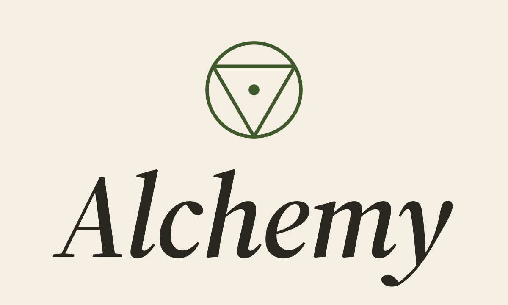

<div align="center">

<a href="https://v2.alchemy.run">
  
</a>

<br />

[](https://www.npmjs.com/package/alchemy)
[](./LICENSE)
[](https://discord.gg/jwKw8dBJdN)

**Infrastructure-as-Effects** — cloud infrastructure and application logic as a single, type-safe [Effect](https://effect.website) program.

[Docs](https://v2.alchemy.run) · [Tutorial](https://v2.alchemy.run/tutorial/part-1) · [Examples](./examples) · [Discord](https://discord.gg/jwKw8dBJdN)

</div>

---

A Worker bound to a R2 bucket and serving objects from it:

```typescript
const Bucket = Cloudflare.R2Bucket("bucket");

export default Cloudflare.Worker(
  "api",
  { main: import.meta.url },
  Effect.gen(function* () {
    const bucket = yield* Cloudflare.R2.ReadWrite(Bucket);
    return {
      fetch: Effect.gen(function* () {
        const request = yield* HttpServerRequest;
        const object = yield* bucket.get(request.url);
        return HttpServerResponse.stream(object!.body);
      })
    };
  }),
);
```

One `bind()` wires the binding, env var, and typed connection — at deploy time and at runtime.

---

- **One program, one language.** Resources, Lambdas/Workers, IAM, and SDKs live in the same Effect program — no YAML, no second runtime.
- **Bindings, not glue code.** `S3.GetObject(bucket)` wires the IAM policy, env var, and a typed SDK call in a single line.
- **Errors in the type system.** Every cloud API failure is a tagged Effect error you handle — or don't — on purpose.
- **AWS + Cloudflare today.** S3, SQS, DynamoDB, Kinesis, Lambda, EC2 / Workers, R2, D1, Durable Objects, Containers.
- **Same code, every stage.** Local dev, `plan` / `deploy`, smoke tests, and CI all share one mental model.

```sh
bun add alchemy@next effect@next
```

## GitHub Action

Use the root action to deploy `prod` from `main`, deploy PR previews as
`staging-{number}`, and destroy PR previews when the PR closes:

```yaml
- uses: alchemy-run/alchemy-effect@v1
  env:
    CLOUDFLARE_ACCOUNT_ID: ${{ vars.CLOUDFLARE_ACCOUNT_ID }}
    CLOUDFLARE_API_TOKEN: ${{ secrets.CLOUDFLARE_API_TOKEN }}
    GITHUB_TOKEN: ${{ secrets.GITHUB_TOKEN }}
```

The workflow must install the `alchemy` CLI before this action runs.

## Bootstrap with an AI coding agent

Paste this into Claude Code, Cursor, or any agent that can fetch a URL:

```
You are an Alchemy expert. Read https://v2.alchemy.run/llms.txt to load the
full documentation index, then act as my pair on this project.

Goal: help me set up, build, test, and deploy a cloud application with
`alchemy` (Infrastructure-as-Effects, powered by Effect).

Follow the patterns from the docs and the /examples folder. Stay idiomatic
to Effect: use Layers for wiring, return Effects from lifecycle code, and
keep infra and runtime in the same program. Ask before introducing new
dependencies or breaking conventions.
```

## Learn more

- [What is Alchemy?](https://v2.alchemy.run/what-is-alchemy) — the framework in 2 minutes
- [Getting Started](https://v2.alchemy.run/getting-started) — your first Stack
- [Tutorial](https://v2.alchemy.run/tutorial/part-1) — five-part walkthrough to a tested, CI-deployed app
- [Examples](./examples) — runnable projects on AWS and Cloudflare
- [llms.txt](https://v2.alchemy.run/llms.txt) — agent-ready documentation index

> **alchemy** is in alpha. Expect breaking changes. Come hang in our [Discord](https://discord.gg/jwKw8dBJdN).

## License

Apache-2.0
